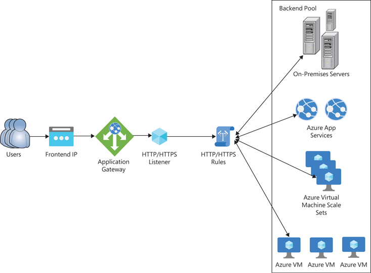

# Azure Application Gateway

Terraform repository for deploying Azure Application Gateway with backend pools of Azure App Services. Supports HTTPS
via TLS certificate. Automates DNS configuration using PowerShell scripts and Cloudflare.

## DEV

- https://agwy-dev.razumovsky.me
- http://agwy-dev.razumovsky.me

## QA

- https://agwy-qa.razumovsky.me
- http://agwy-qa.razumovsky.me

## Docs

- https://learn.microsoft.com/en-us/azure/application-gateway/overview
- https://quizlet.com/pl/975398961/azure-application-gateway-flash-cards/

## Azure Application Gateway components

- **Frontend IP** - Public or internal IP address that accepts incoming traffic to App Gateway
- **Frontend IP Configuration** - Binds Frontend Public IP address to Azure Application Gateway
- **Gateway IP Configuration** - Binds an application gateway within specific subnet ensuring internal communication
- **Frontend Port** - Defines a port that accepts incoming HTTP or HTTPS requests to application gateway
- **Backend Pool** - A list of IP addresses or FQDN where incoming HTTPS or HTTPS traffic is being forwarded
- **HTTP Listener** - A component that checks for incoming HTTP or HTTPS requests on a specified Frontend IP and Port.
  It determines how requests are processed based on its configuration, which includes Hostname, Protocol, and SSL
  settings
- **Backend HTTP Settings** - Defines how application gateway sends incoming traffic to backend servers, by setting up a
  Protocol, Backend port and Timeout interval
- **Routing Rules** - Defines how incoming requests are forwarded to backend targets. They link HTTP Listeners to
  Backend Pools by specifying the appropriate Backend HTTP settings
- **Health Probe** - Ensures that traffic is delivered only to healthy backend servers

## Azure Application Gateway architecture

## Steps to configure Azure Application Gateway

- Deploy virtual network
- Deploy application gateway subnet
- Deploy application gateway public IP
- Associate gateway with subnet using `gateway_ip_configuration` block
- Define app gateway frontend ports (80, 443) by using `frontend_port` block
- Associate app gateway with public IP using `frontend_ip_configuration` block
- Define backend pools with app services FQDNs by using `backend_address_pool` block
- Define HTTP settings for routing rules by using `http_settings` block
- Add http and https listeners to the app gateway using `http_listener` block
- Define routing rules to handle requests based on headers CN
- Create a Cloudflare DNS record for the app gateway public IP and test connection
